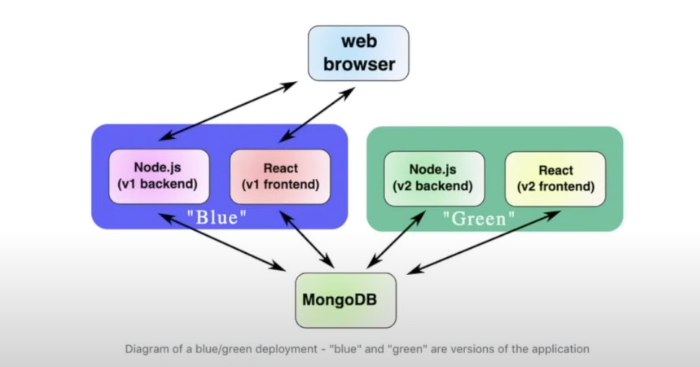
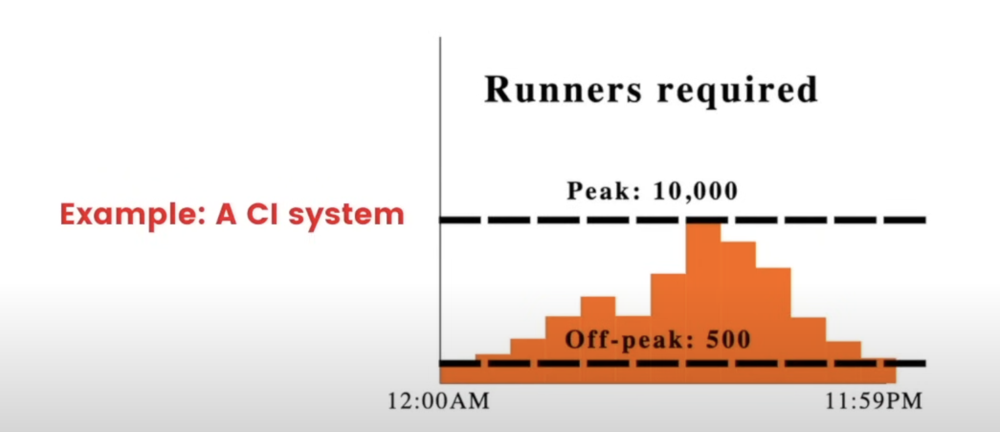

# DevOps

- Section 1: DevOps Intro
- Section 2: TDD
- Section 3: CI
- Section 4: Code coverage
- Section 5: Linting best practices
- Section 6: Ephemeral environments
- Section 7: VMs vs. Containers
- Section 8: Rolling Deployments
- Section 9: Blue/green deployments
- Section 10: Autoscaling
- Section 11: Service discovery
- Section 12: Application performance management

## Section 1: DevOps Intro

- Methodology to build products by continuously getting user feedback

  > Sequence: Plan -> code -> build -> test -> release -> deploy -> operate -> monitor

- DevOps Engineering: being able to build, test, release and monitor applications
- 3 pillars:
  - 1. PR automation: understand if proposed changes are good faster
  - 2. Deployment automation: deploy code in a way users don't complain
  - 3. Application performance management: automation to check if things are healthy

### PR Automation

- Developer feedback cycle
- Gates to identify if changes are suitable
- Automatic and manual feedbacks for changes
  - Automation in PR
  - Code review: another dev informs about code style, architecture, and observations
- What can we automate?
  - Continuous integration (CI)
  - Automated security scanning
- Goal as DevOps: proposals should get reviewd and merged within 24 hours of when they are made
- DevOps is fundamental, especially as the product matures

### Deployment automation

- Deploy feature to certain set of users as a final test before rolling out publically
- Starting new versoin of services without down time
- Rolling back to prior version in case something goes wrong

### Application Performance Management

- Metrics: numering measurements of key numbers in production
- Logging: text descriptions of what's happening during processing
- Monitoring: take metrics and logs to convert them into health metrics
- Alerting: if there's a problem, notify responsible parties

### Different scenarios and different DevOps needs

- New startup with no users: Github, Vercel, LayerCI
- 10 enterprise customers: Github, Sentry, PagerDuty, CodeCov, Bitrise/CircleCI
- Heavy user-online apps: Github enterprise, sentry, ElasticSearch/Logstash/Kibana, Pingdom, Launch Darkly, Terraform

## Section 2: TDD

- Testing is fundamental for Continuous Integration
- TDD: Test-Driven Development. Tests are written before code. Tests drive the development
- Unit tests
- Integration tests
- System (end to end) tests
- Acceptance tests

### TDD Goals

- To know when something breaks and where
- To know the whole system is working correctly

### Worflows

#### Without TDD

1. Choose something to work on
2. Build it based on specifications
3. Test it with small scripts

### With TDD

1. Choose something to work on
2. Write tests that'd pass if product works
3. Keep building it until tests pass

- Results are the same, however, TDD forces prioritization of tasks

## Section 3: CI

- Continuous Integration: Pushing changes to a central git repo
- Changes are verified by an automatic software that runs comprehensive tess to insure no major issues appear
- Every time a developer proposes some changes, we should run some tests before we can safely merge the code

### Benefits of CI

- First step to DevOps automation and helps with code collaboration
- It provides confidence and speed in making changes because we know previous functionality won't be broken by new ones
- Master branch -> feature 1 branch

### Docker

- 1. Create docker file and build the image `docker build -t [image-name] .
- 2. Create docker-compose.yaml to make it easier running the container

```yml
version: "3.8"

services:
  web:
    image: dev-ops-nextjs
    build:
      context: .
      dockerfile: Dockerfile
    ports:
      - "3000:3000"
    container_name: container-dev-ops-nextjs
    volumes:
      - .:/app # Mount current directory to /app in the container
      - /app/node_modules # Avoid overwriting `node_modules` inside the container
    environment:
      NODE_ENV: development
```

- Docker compose is fundamentally a way to run multiple containers

### Github Actions

- Once the application is dockerized, create the github workflow: ./github/workflows/[ci-name].yml
- Workflow has jobs, jobs have steps and steps have actions
- This allows us to run a battery of tests on specific events: push, pr, scheduled, etc.
- Act allows us to run GitHub actions locally: `https://github.com/nektos/act`

```yml
# appears in the Actions tab on Github
name: [workflow-name]

# on: defines the events that trigger the workflow
# when should it run? => pushes? | pull requests ? | scheduled times?
on:
  push:
    branches:
      - main
  pull_request:

# jobs: collections of tasks that make up the workflow
jobs:
  # job 1: build-and-test
  build-and-test:
    runs-on: ubuntu-latest # specify the environment the job will run

    # steps: sequence of actions | commands within a job
    steps:
      # Step 1: Checkout the code
      - name: Checkout code
        # uses: reusable action or prebuilt functionality. It pulls a specific actions from the Github actions marketplace or Github-provided actions
        uses: actions/checkout@v3

      # Step 2: Set up Docker
      - name: Setup Docker
        uses: docker/setup-buildx-action@v2

      # Step 3: Build the Docker image
      - name: Build Docker image
        # run: executes a shell command or script. Defines custom commands
        run: docker compose build

      # Step 4: Run the Docker container
      - name: Run Docker container
        run: docker compose up -d

      # Step 5: Test app
      - name: Test app
        run: |
          sleep 10
          curl -f http://localhost:3000 || exit 1

      # Step 6: Stop and remove the container
      - name: Stop and remove container
        run: docker compose down
```

### Run github actions locally with Act

- Test github actions without having to push them

### Yaml

- Yaml is fundamentally a combination of JSON with Python
- Root object is equivalent to an object/dictionary
- 1 is interpreted as number. If you want it to be interpreted as boolean use true

## Section 4: Code coverage

- Quantitatively measures how comprehensive a code base's tests are
- Increasing code coverage increases stability and reduces bugs
- Functions have:
- Syntax lines: basically curly braces
- Logic lines: have side effects. If you remove|change them, the behavior changes
- Branch lines: for loops and if-statements. They sequential order of the instructions
- code_coverage = non_syntax_code_lines_with_tests / non_syntax_code_lines
- Branch coverage: instead of measuring how many lines of code are tested, it measures groups of lines
- How many branches in a function body is tested
- Don't optimize for code coverage until that's important

### When is code coverage important?

- Product has users and users might leave if affected by bugs
- Working with developers that aren't immediately trustworthy (contractors/interns)
- Large codebase with many testable components

### Rules for code coverage

1. Code coverage must not decrease: as you increase the code base, you should also increase the code coverage for it. The ratio shouldn't go down

- With this policy, features will be shipped more slowly

2. Code owners for test files: changing the testing implementation can only be approved by a senior developer

## Section 5: Linting Best Practices

- Linters look at a program's source code and find issues automatically given some requirements
- "Obvious" bugs don't make it to production
- Google style guide is a good start
- Linting can also be automated in the CI
  - Easy solution in CI: no merging if linting fails
  - If the code passes the linting, the reviewer doesn't need to worry about small stylistic choices
  - The CI could also automatically lint the code -- creating a new, linted branched based on the current, non-linted branch
- Any team with more than one developer working on the same codebase should setup a linter to catch obvious bugs

```yaml
COPY . .
RUN npm run lint
```

## Section 6: Ephemeral environments

- Temporary deployments that have a self-contained version of your application, generally every feature branch
- Valuable DevOps code review experience
- Halfway between developing enviroments and staging environments
  - `development | ephemeral | staging`
- Setting up an ephemeral environment poses state | database challenges
- Isolated from production environments and only last until the PR does
- Every time a developer proposes a change, they should get a new db specific for that change

### Benefits

- Accelerates software development lifecycle
- Changes can be shared with managers and other non-dev stakeholders

### Ephemeral environments and databases

- Prepolulated data: it contains representative, anonymized data -- to pass security audits. Identifiable Information (PII) must be scrubbled from databased to be used
- Undoable: if data is deleted or modified, it should be easy to reset the database to its original state
- Migraed: Database uses the schema currently used in production, and has proposed migrations run agains it: one of the most common classes of problems uncovered by ephemeral environments are broken or non-performant database migrations

### Ephemeral environments and lifecycles

When do you create them and when do you destroy them?

- Option A: tie the lifecycle to the life of a PR or merge request
- Option B: ChatOps that allows creating a new environment for a specific branch with a timeout
- Option C: Create an eph. environment for every commit and hibernate them once they are provisioned and wake them up when requested

### Continuous Staging Definition

- CI/CD is merged with ephemeral environments to form a unified CI/CD and review process for every commit

## Section 7: VMs vs. Containers

- Linux keeps track of 4 things: Memory, CPU (processors), Disk, Devices
- Linux shares resources across multiple processes, so they can run at the same time
- VMs and containers are great to solve issues related with the sharing of resources
  - They allow us to separate different resources
  - When moving programs into containers or VMs, each program will have its own versoin of shared resources (files and network ports)

### How containers work

- Containers work by creating "namespaces", which are a Linux feature that group shared resources together

  - ```
    # to check running resources
    ps aux | wc -1 #
    ```

- The programs are asking "what are the contents of /usr/lib/python"? And instead of answering truthfully, Linux is answering with: "var/lib/docker/overlayfs/1/usr/lib/python"
  - This deception allows programs to run in parallel, because Linux'd respond with different files for every container

### How VMs work

- VMs are basically simulators
- While containers provide a "fake" version of Linux, VMs provide "fake" versions of the CPU, RAM, disk, and devices. Then, VMs "fake" at one level deeper
- Hypervisor: Similar to Docker, but for VMs
  - Through VMs, we can run different OS

### VMs vs. Containers Performance

- CPU in VMs is 10-20% slower than containers
- VMs use 50-100% more storage -- containers don't need all the files the OS would need
- VMs use ~200mb of memory each for the "inner OS", while containers have essentially no memory overhead
- Therefore, VMS are slower, need more storage and have memory overhead. Containers are more lightweight

#### When VMs are better than containers

- If you're running untrusted code -- it's difficult to be confident that malicious code can't "escape" a container
- Running MacOS or Windows within a Linux server
- Need to emulate hardware devices

## Section 8: Rolling deployments

- Rolling deployment: strategy to deploy a new version of an application without downtime by recursively switching previous version to new one
  - Rolling deployment algorithm:
    - 1. Create an instance of the new version of the backend
    - 2. Wait until new copy is up
    - 3. Delete an instance of the old version of the backend
    - 4. If any instances of the old version still exist, go back to step 1

## Section 9: Blue/green deployments

- Blue/green deployment: strategy to deploy an application by starting a new instance of the application and routing traffic over to it
  - Blue/green create two clusters of the application
    
- Powerful and extensible deployment strategy that works well with teams tat are deploying a few times per day
  - It can become problematic in CD scenarios where there are many services being deployed many times per day

## Section 10: Autoscaling

- Automating horizontal scaling to ensure the number of workers is proportional to the load on the system
  

- During peak time, we should be able to create new ones, while off-peak hours, destroy them
  - Technologies that do this: AWS EC2 Spot instances, Kubernetes horizontal pod autoscaling

### Serverless vs Autoscaling

- Autoscaling is usually discussed on the timeline of ~1 hour chunks of work.
- When taking autoscaling to its limit, we'd get serverless: define resources that are quickly started, and use them on the timeline of ~100ms.
- Serverless is the extreme of autoscaling in implementation and conceptualization
  - E.G.: a web server might not exist at all until a visitor requests the page. Then, it's spun up specifically and exclusively for that request. It serves the page, then shuts back down.

## Section 11: Service discovery

- A key problem in deployment is getting services to be able to find each other.
  - DB might be at 10.1.1.1:123 while the webserver is at 10.1.2:999
- When a user visits a website, the services at play and their connection are:

  1. the browser should know that example.com is at some specific IP
  2. the browser should knoe that api.example.com is at some other specific IP
     > browser needs to know the IP address of the DNS and the IP address of the server
  3. the backend should know that the database is at some specific IP
     > backend needs to know the IP address of the database

- A simple IP mapping is usually enough for an MVP, however, service discovery becomes important when:
  1. You want "zero time deployments"
  2. More than a couple of microservices
  3. Deploying several environments (dev/staging/ephemeral/production)

### Nginx

- Very popular reverse proxy

### DNS: Domain Name Service

- It maps the name of a website -- human-readable format -- to an actual IP, which represents some random computer somewhere
- To check the IP of an website, we can: `dig website-dns`, e.g.:`dig google.com`

```bash
➜  dev_ops git:(main) dig google.com

; <<>> DiG 9.10.6 <<>> google.com
;; global options: +cmd
;; Got answer:
;; ->>HEADER<<- opcode: QUERY, status: NOERROR, id: 22352
;; flags: qr rd ra; QUERY: 1, ANSWER: 1, AUTHORITY: 0, ADDITIONAL: 1

;; OPT PSEUDOSECTION:
; EDNS: version: 0, flags:; udp: 512
;; QUESTION SECTION:
;google.com.                    IN      A

;; ANSWER SECTION:
google.com.             228     IN      A       142.251.37.14

;; Query time: 75 msec
;; SERVER: 192.168.1.1#53(192.168.1.1)
;; WHEN: Wed Jan 15 20:39:42 CET 2025
;; MSG SIZE  rcvd: 55

➜  dev_ops git:(main) ✗ dig chatgpt.com

; <<>> DiG 9.10.6 <<>> chatgpt.com
;; global options: +cmd
;; Got answer:
;; ->>HEADER<<- opcode: QUERY, status: NOERROR, id: 20473
;; flags: qr rd ra; QUERY: 1, ANSWER: 2, AUTHORITY: 0, ADDITIONAL: 1

;; OPT PSEUDOSECTION:
; EDNS: version: 0, flags:; udp: 512
;; QUESTION SECTION:
;chatgpt.com.                   IN      A

;; ANSWER SECTION:
chatgpt.com.            38      IN      A       104.18.32.47
chatgpt.com.            38      IN      A       172.64.155.209

;; Query time: 70 msec
;; SERVER: 192.168.1.1#53(192.168.1.1)
;; WHEN: Wed Jan 15 20:39:50 CET 2025
;; MSG SIZE  rcvd: 72
```

## Section 12: Application performance management

- Application performance management is composed of:
  1. Log aggregation: collecting different application logs into a centralized place. Deals with texts.
  2. Metrics monotoring: collects data to identify the health of the application. Deals with numbers.

### 12.1: Log aggregation: collecting and tagging application logs from many services into a single dashboard

- Stage where the product is deployed and you want to keep track that it's working reliably. It's the service analytics
- Helps to identify any problems in production

- ELK: ElasticSearch + Logstash + Kibana -> open source APM, application performance management

  - Logstash: Log processor
  - Elastic search: Data store
  - Kibana: frontend log display

- Other APM platforms:
  - Fluentd
  - DataDog
  - LogDNA
  - AWS CloudWatch logs

## 12.2 Vital production metrics

- For it, we need to understand what are the main aspects of our application and the profile of our users. For example:

  - Request fulfillment times
  - Request counts
  - Service resources

- Open-source technologies
  - Prometheus: one of the most popular metrics services
